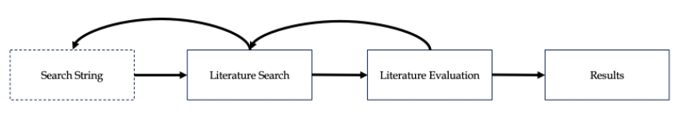
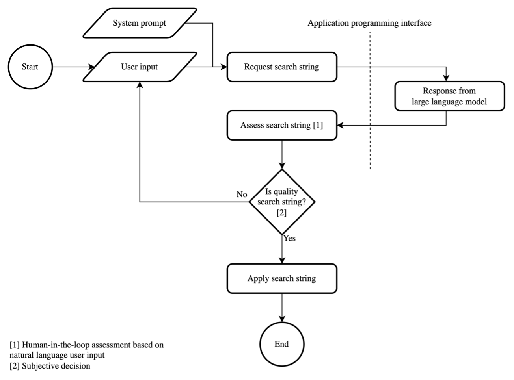
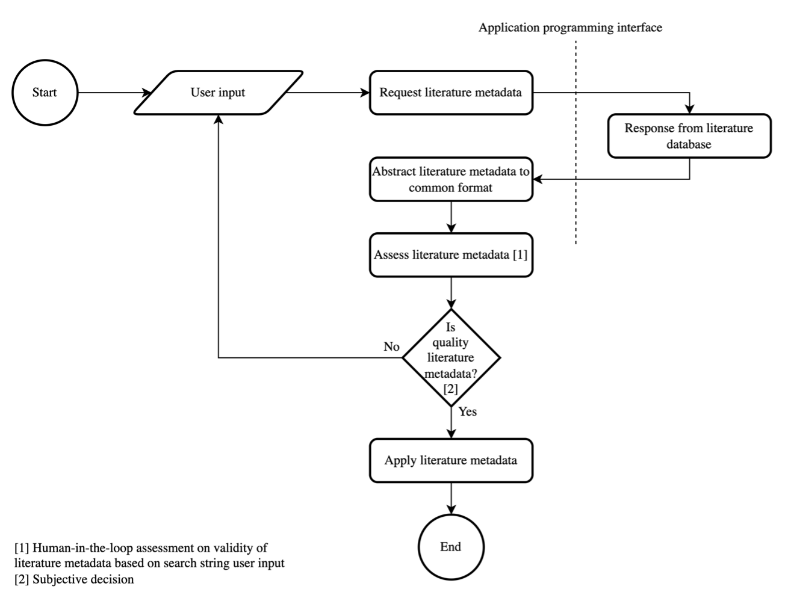
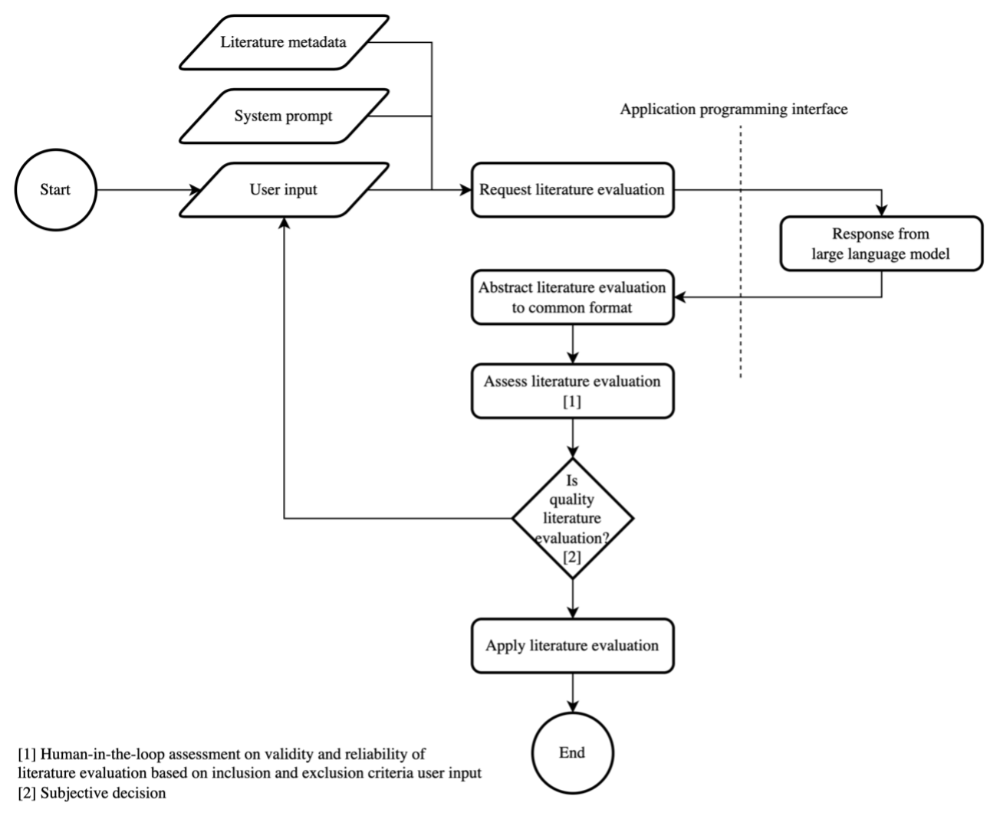
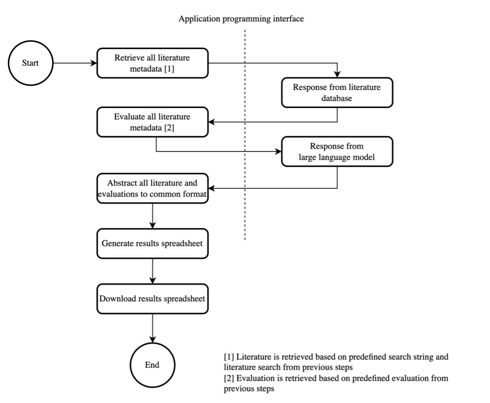

# Auto Literature Review

Available at [https://auto-literature-review.vercel.app/](https://auto-literature-review.vercel.app/).

Fast and automated study selection for literature review with Scopus and OpenAI.

## How it works

Auto Literature Review (ALR) follows a systematic literature review process consisting of three key stages: the formulation of a search string for Scopus database, the execution of literature search, and the evaluation and selection of studies using natural language and machine learning reasoning. The results from each stage are automatically aggregated into a final output, as shown in the figure below.

### Configuration

ALR uses Scopus and OpenAI APIs to perform the literature search and evaluation. To use the APIs, you need to create an account and request API keys on [Scopus](https://dev.elsevier.com/) and [OpenAI](https://platform.openai.com). After obtaining Scopus API key, you must request for Institutional Token, as it is required to access abstracts of the articles.

You must enter API keys at [https://auto-literature-review.vercel.app/configuration](https://auto-literature-review.vercel.app/configuration) to use the application.

> [!TIP]
> Your API keys never leave your browser and are stored in the browser's local storage. They are used only to make straight requests from your browser to Scopus and OpenAI APIs.

### Search String

The Search String stage enables users to input a natural language description of a topic or discipline they wish to explore, and the system responds with a reasoned, Scopus-compatible search string. As illustrated in figure below, this process is guided by a predefined [system prompt](./src/state/effects/openai/search-string-system-prompt.ts) to ensure that responses strictly follow the Scopus search format.

### Literature Search

The Literature Search stage enables users to perform Boolean searches against the Scopus database and efficiently evaluate the returned results, as illustrated in the following figure.

### Literature Evaluation

The Literature Evaluation stage enables users to request AI-driven reasoning on a test set derived from the Literature Search stage output. Users can provide natural language selection criteria, accompanied by a predefined [system prompt](./src/state/effects/openai/evaluate-literature-system-prompt.ts), to assess the relevance of identified literature. In response, the system evaluates whether a paper meets the criteria and provides a reasoned justification, as illustrated in following figure.

### Results

The Results stage processes all entries from the Literature Search stage, evaluates each based on the criteria defined in the Literature Evaluation stage, and compiles the final output into a standardized spreadsheet format, as illustrated in following figure.

## Development

This project uses dev containers to ensure a consistent development environment. To get started, you need to have Docker and Visual Studio Code installed. Please refer to official [documentation](https://code.visualstudio.com/docs/devcontainers/containers#_quick-start-open-a-git-repository-or-github-pr-in-an-isolated-container-volume) on how to get started with dev containers.

If you don't prefer to use dev containers, you can follow [.devcontainer/Dockerfile](.devcontainer/Dockerfile) to install the required dependencies on your local machine.

### Running the project locally

Run `npm run dev` to start the development server. The server will be available at `http://localhost:3000`.

### Running tests

Run `npm run test` to run tests.

## Releasing

This project uses [changesets](https://github.com/changesets/changesets) to manage releases. Therefore, [include a changeset](https://github.com/changesets/changesets/blob/main/docs/adding-a-changeset.md) in your pull request following guidelines.

## License

This project is licensed under the MIT License - see the [LICENSE](./LICENSE) file for details.
